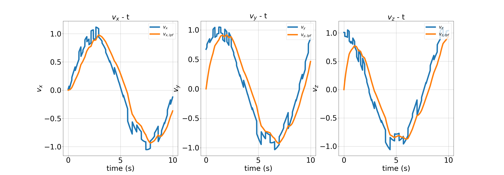

# disturbance_estimator

## 1. Low pass filter

The filter utilizes dorpri method to process noisy data. 

Create Lpf object and, then pass the time constant for the low pass filter.

```
Lpf lpf;
lpf = Lpf(2.0);
```

Apply noisy data into the lpf object and set the time to process ode function of which numerical method is dopri.

```
lpf.apply_input(v_noisy);
lpf.set_time(time);
lpf.get_filtered_vector(v_lpf);
```

The test result of low pass filter is like the below.

