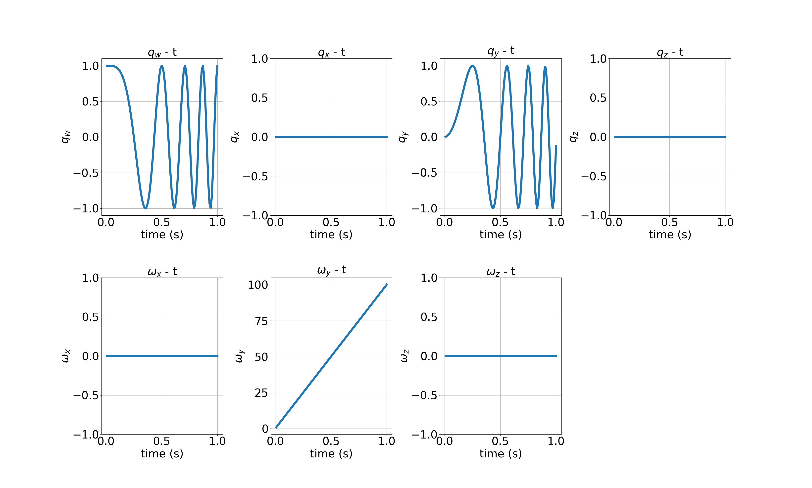
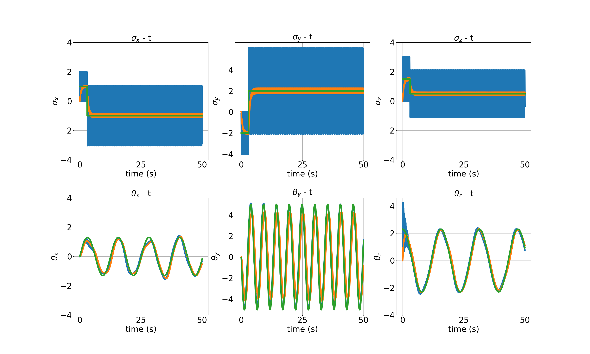
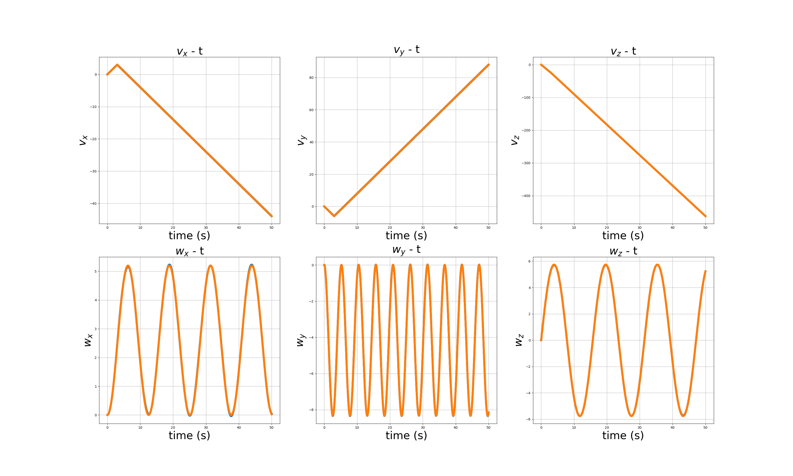
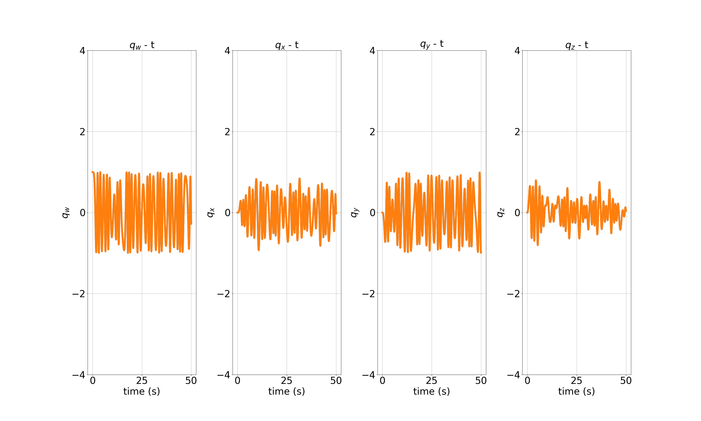

# disturbance_estimator

## 1. True model implementation

### a. Attitude dynamics validation

Validation setup...

Apply angular disturbance component along the only y axis.

```
u.setZero();
sigma_ext.setZero();
theta_ext << 0, 1, 0;
...
true_model.apply_input(u);
true_model.apply_disturbance(sigma_ext, theta_ext);
```

The effect of inertial torque is small compared to that of the disturbance. 

As you can see, the only y component of quaternion among x, y, and z axes varies when only the moment along y axis is disturbed.



### b. Translational dynamics validation

## 2. Low pass filter

The filter utilizes rk4 method to process noisy data. 

Create Lpf object and, then pass the time constant for the low pass filter.

```
Lpf lpf;
lpf = Lpf(2.0);
```

Apply noisy data into the lpf object and set the time to process ode function of which numerical method is rk4.

```
lpf.apply_input(v_noisy);
lpf.set_time(time);
lpf.get_filtered_vector(v_lpf);
```

The test result of low pass filter is like the below.


## 3. L1 disturbance estimator

The parameter setup for $\Gamma$ is like the below:

$\Gamma_{\sigma} = 1000 I_{3}$

$\Gamma_{\theta} = 500 I_{3}.$

$k_{\tilde{q}} = 5, k_{\tilde{\omega}} = 2, c =1.0$

The below picture shows the test result of disturbance estimator.

Herein, the translational and orientational disturbance is step-wise and sinusoidal, respectively.

The first and second row represent the external force and moment estimation result, respectively.

The blue, orange, and green line denote the raw, L1 estimated disturbance and ground truth, respectively.

Since the blue signal tends to be noisy due to the large amount of $\Gamma$ parameter, the low pass filter is required to attenuate the noise.






